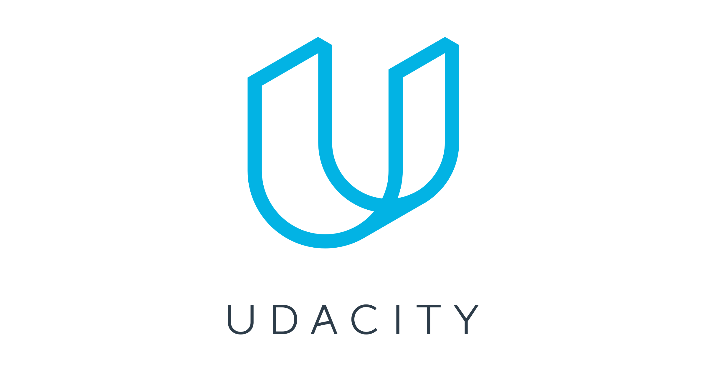

# navigate.AI
**navigate.AI** is a travel assistance system that uses artificial intelligence (AI), this project is developed in the programming language "Python" and has the objective of using "Deep Learning" to safely guide a car.

| 

 | 

 | 

 |
| ------------ | ------------ | ------------ |
| 

 | 

 | 

 |

# How to use the script
## Requirements
1. Download [Udacity Self Driving Car Simulator](https://github.com/udacity/self-driving-car-sim "Udacity Self Driving Car Simulator").
1. You can just install [anaconda](https://www.anaconda.com/products/individual "anaconda")/[miniconda](https://docs.conda.io/en/latest/miniconda.html "miniconda") and use **environment.yml** (for training using your **CPU**) or **environment-gpu.yml** (for training using your **GPU**). Or if you prefer using **pip** you can try to install the dependencies in the files (Note that you should use **Python3.5.2**).

1. If you want to train the model using your **GPU** you need to install [CUDA v.8.0](https://developer.nvidia.com/cuda-80-ga2-download-archive) and [CuDNN v.5.1](https://developer.nvidia.com/rdp/cudnn-archive") (Note that CUDA v.8.0 is slightly old and may not work with your GPU).

1. Create conda environment using **environment.yml** if you want to use the **CPU** for training your model:
	- `$ conda env create -f environment.yml`

1. Create conda environment using: **environment-gpu.yml** if you want to use the **GPU** for training your model:
	- `$ conda env create -f environment-gpu.yml`

1. And to activate the environment run:
	- `conda activate navigateAI`

1. **If it starts outputing an** "GET /socket.io/?EIO=4&transport=websocket HTTP/1.1" **error** or "ImportError: No module named 'secrets'" **when you run model.py or drive.py**, just install this version of the engineio and reinstall socketio using:
	- `pip install python-engineio==3.13.0`
	- `pip install python-socketio`
	- `conda install python-socketio`
	
## To train your model
You need to have data, you can **gather it youself by playing** on the simulator in "Training Mode" using "W, A, S, D". Or you can use [the one provided by Udacity](https://d17h27t6h515a5.cloudfront.net/topher/2016/December/584f6edd_data/data.zip "the one provided by Udacity") to train your network.
Once you have the data you'll have a **.csv** file and an **"IMG"** folder, just put the .csv inside the **"data"** folder located in the **repo folder**, and **don't move the "IMG" folder** or else you'll have to put it where it was, or change all the images path inside the .csv file.

After that train running model.py:
- `$ python model.py`

## To play your trained model
Play running play.py followed by the trained model name:
- `$ python play.py navigateAI.h5`
